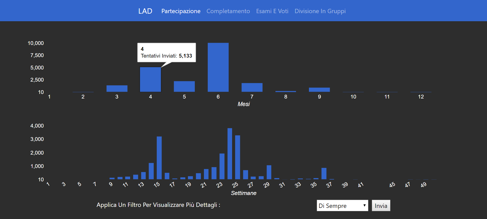
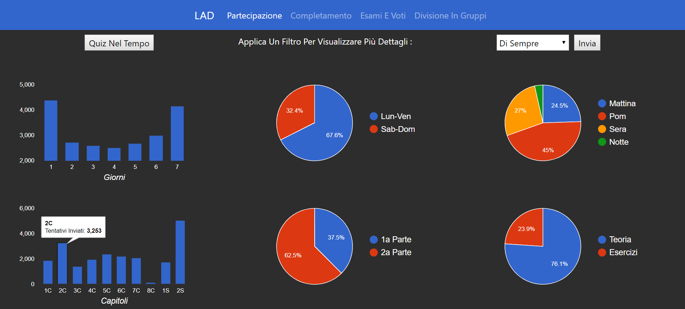
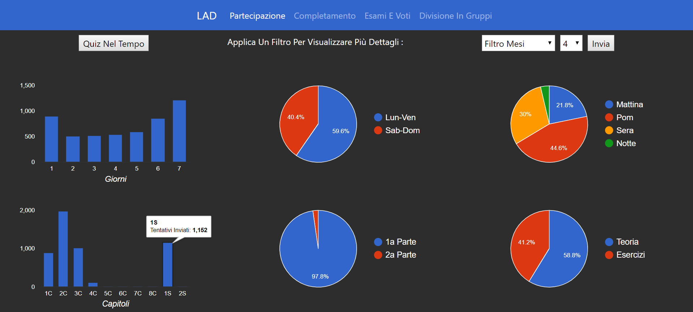
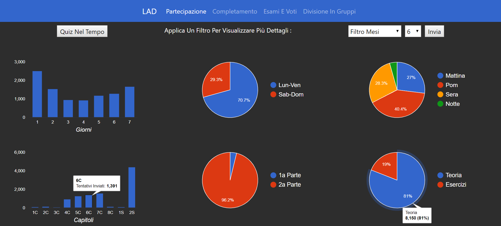
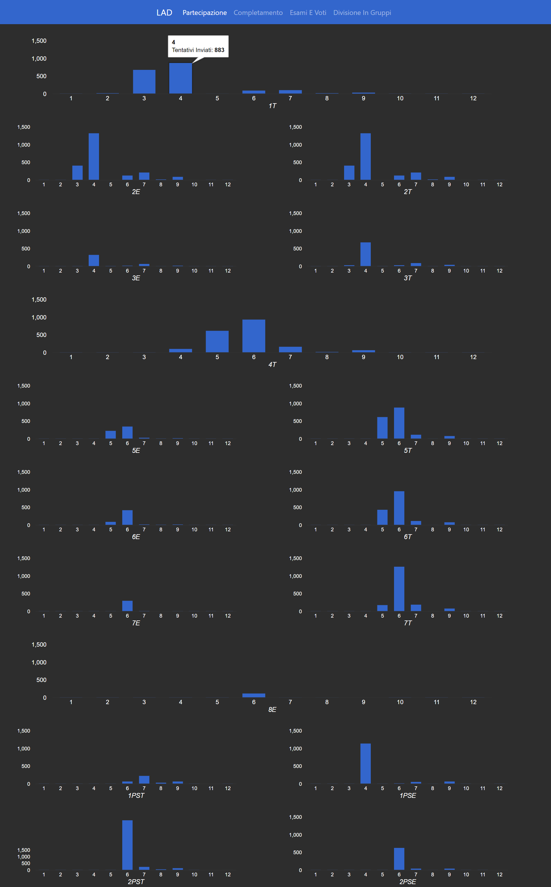
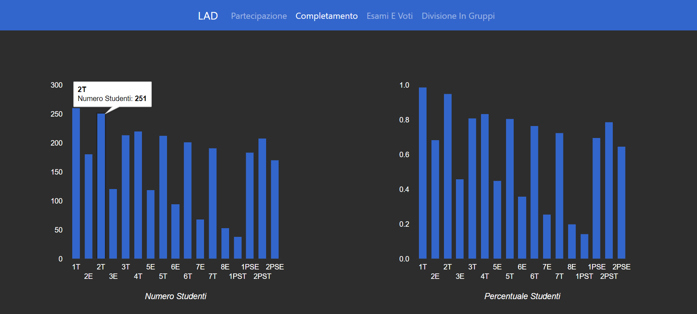
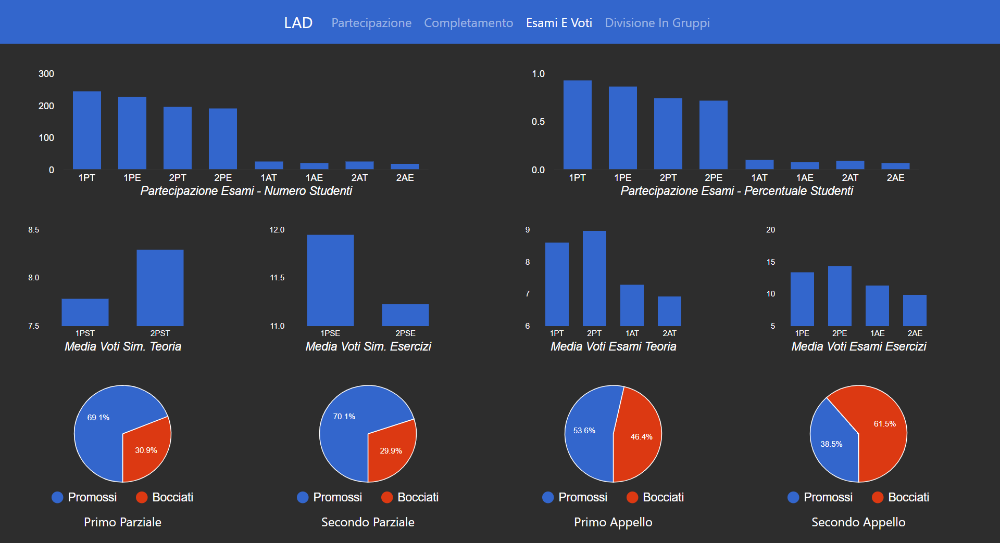
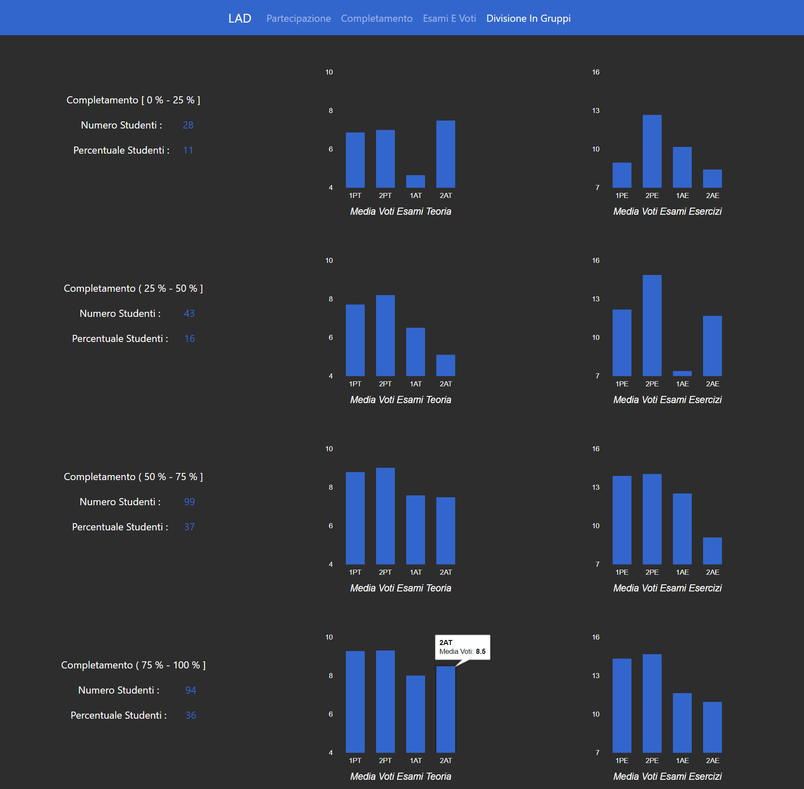
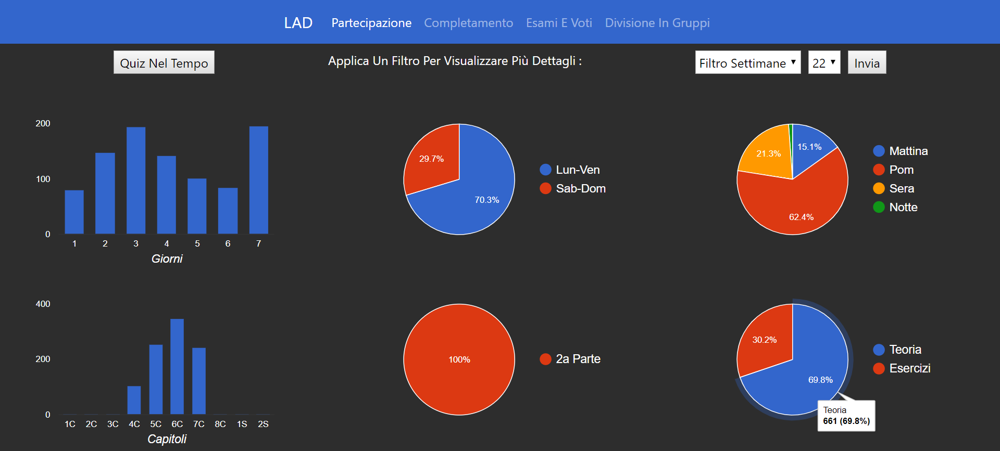

# LearningAnalyticsDashboard

Realizzazione di una Learning Analytics Dashboard in HTML, CSS, JavaScript, NodeJS, Express ed EJS.

Questo software è uno strumento che mostra con chiarezza e semplicità varie informazioni sugli studenti di un corso universitario, utilizzando anche grafici, tabelle ed immagini.

Progetto realizzato per lo stage trimestrale del corso di Laurea Triennale in Informatica dell'università degli studi di Milano-Bicocca.

## Immagini

